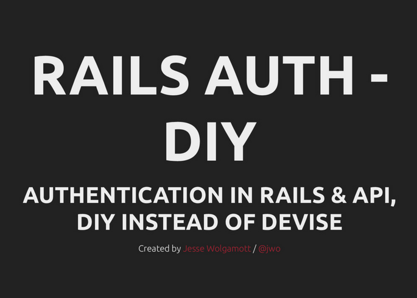

# An exploration into

Slides:

[Download Slides PDF](DIY Rails Auth - by Jesse Wolgamott.pdf)

Code:
* Tag: 'before-demo' for before the creation of Auth
* 52285ea3b7ec82e4728166a7cfb4ae6d8c44e430 - Adding Auth

 This work is licensed under a <a rel="license" href="http://creativecommons.org/licenses/by-nc-sa/4.0/">Creative Commons Attribution-NonCommercial-ShareAlike 4.0 International License</a>.
